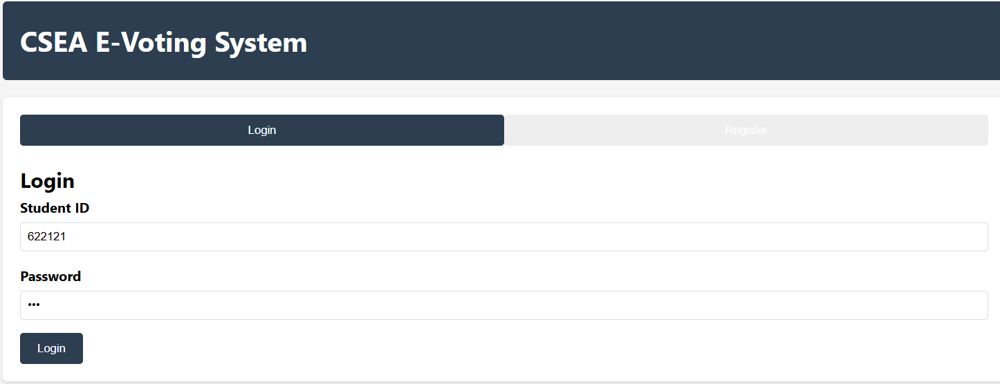
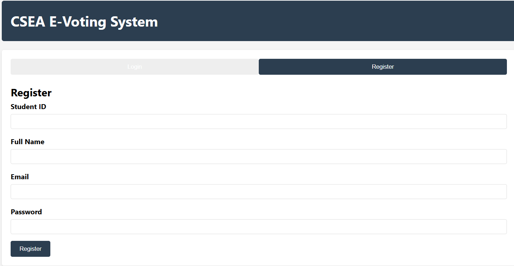
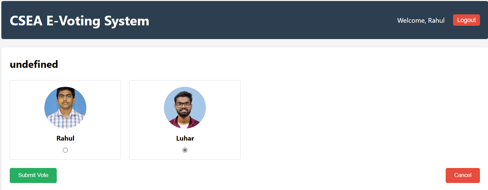
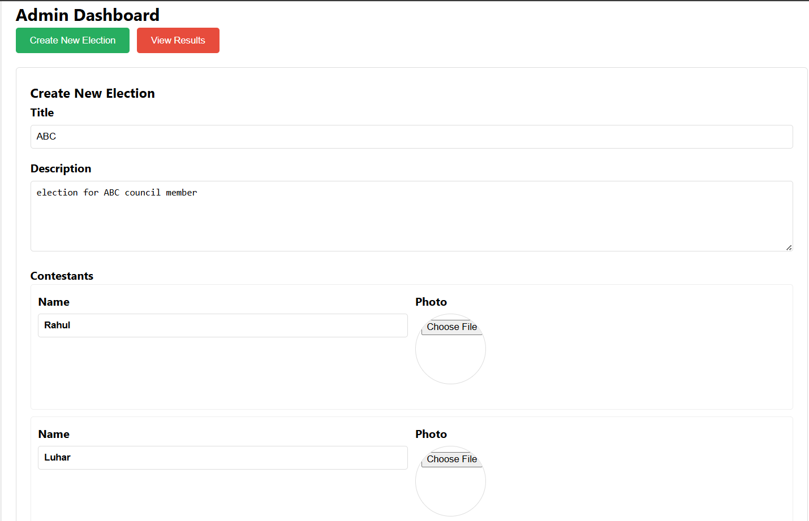
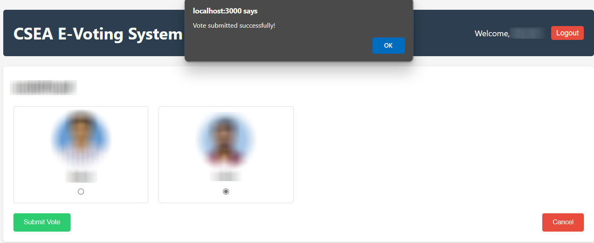
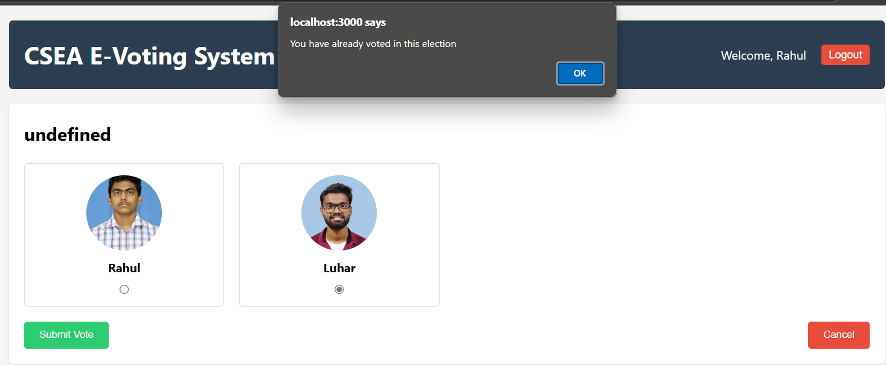
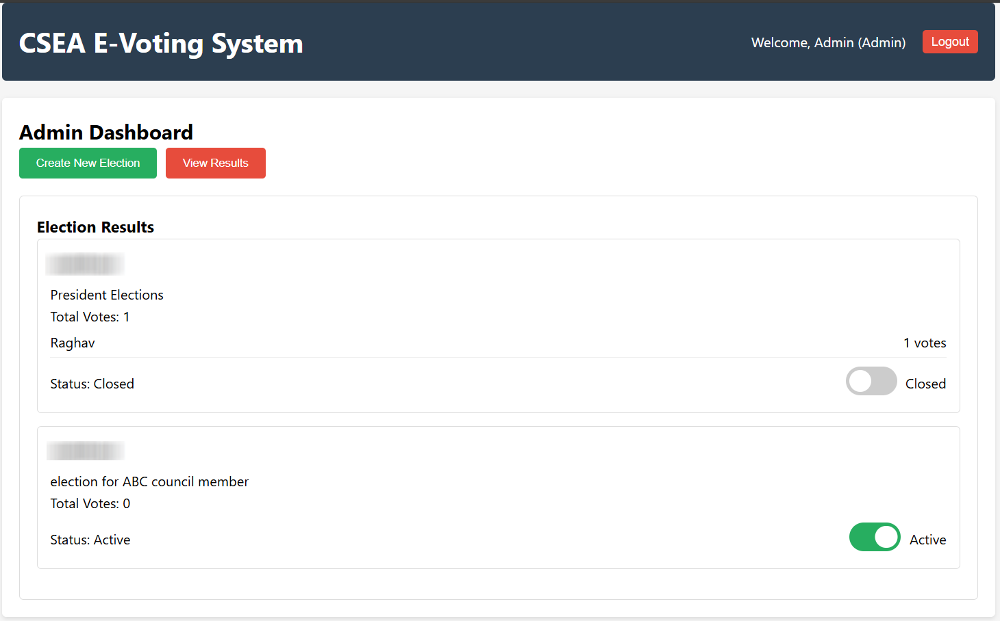

# 🗳️ E-Voting Web Application

A secure and user-friendly online voting system built with HTML, CSS, JavaScript, and Node.js. This platform allows authenticated users to vote in various elections and provides administrators with tools to manage elections, contestants, and results efficiently.

---

## 📸 Preview

| Page                       | Screenshot                                                  |
| -------------------------- | ----------------------------------------------------------- |
| **Login Page**             |                       |
| **Register Page**          |                 |
| **User Dashboard**         |          |
| **Admin Dashboard**        |        |
| **Vote Submitted**         |          |
| **Duplicate Vote Warning** |  |
| **Results Page**           |                        |

> 📁 **Place all your screenshots inside the `screenshots/` folder** and rename accordingly.

---

## 🚀 Features

### 👤 User

- Register and login securely
- View available elections
- Vote in each category **only once**
- View vote confirmation message
- Receive warning if trying to vote again

### 🛠️ Admin

- Secure admin login
- Create and manage elections
- Add contestants per category
- Enable/disable elections
- Monitor real-time voting stats
- Announce winners after voting ends

---

## 🧱 Tech Stack

- **Frontend**: HTML, CSS, JavaScript
- **Backend**: Node.js (Express)
- **Database**: JSON file storage (will be migrated to an SQL database soon)

---

## 📂 Project Structure

```
E_Voting_App/
├── public/                  # Static files (HTML, CSS, JS)
│   ├── login.html
│   ├── register.html
│   ├── dashboard.html
│   └── ...
├── routes/                  # API routes
├── server.js                # Node.js backend entry point
├── database/                # Voter and Election data
├── screenshots/             # Screenshots for README
└── README.md
```

---

## 🛠️ Setup Instructions

### 1. Clone the Repository

```bash
git clone https://github.com/rahboddeda/E_Voting_App.git
cd E_Voting_App
```

### 2. Install Dependencies

```bash
npm install
```

### 3. Run the Server

```bash
node server.js
```

### 4. Open in Browser

Navigate to: `http://localhost:3000`

---

## ✏️ To-Do / Future Enhancements

- [ ] Encrypt user passwords using bcrypt
- [ ] Add email verification
- [ ] Deploy online with database support
- [ ] Make the UI responsive for mobile

---

## 🧪 Test Cases

| Test Case                    | Expected Behavior     |
| ---------------------------- | --------------------- |
| Login with valid credentials | Redirect to dashboard |
| Vote once per category       | Vote is accepted      |
| Vote again in same category  | Warning shown         |
| Admin disables election      | Voting not possible   |
| Admin ends voting            | Winners announced     |

---

## 📄 License

This project is licensed under the [MIT License](LICENSE).

---

## 🙌 Acknowledgements

Thanks to everyone who contributed ideas, testing, and feedback.

---

## 📬 Contact

Created by Rahul Boddeda – rahulboddeda@gmail.com  
Feel free to contact me for feedback or contributions!
